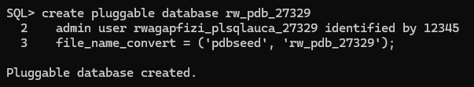
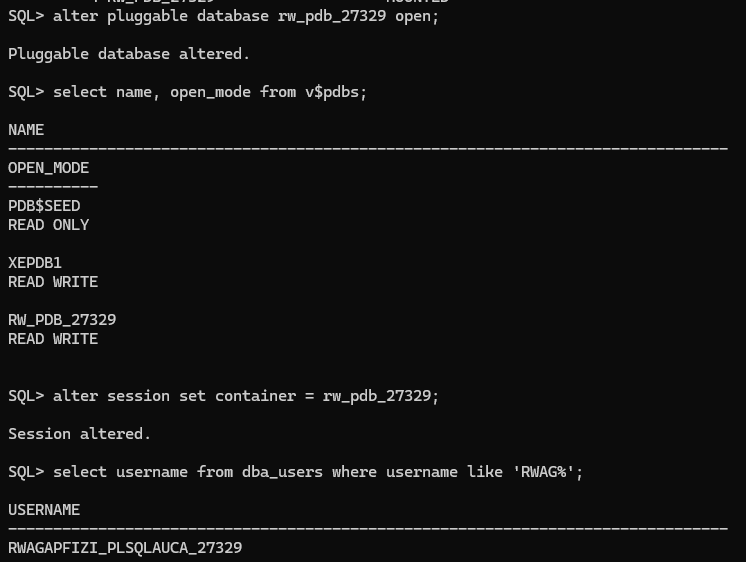
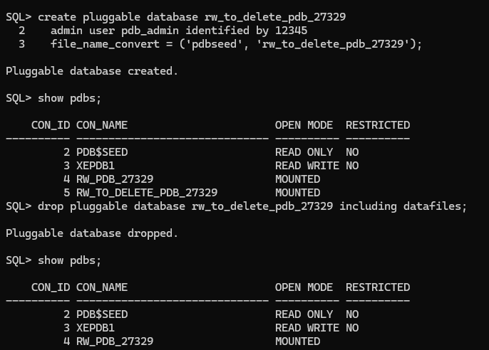
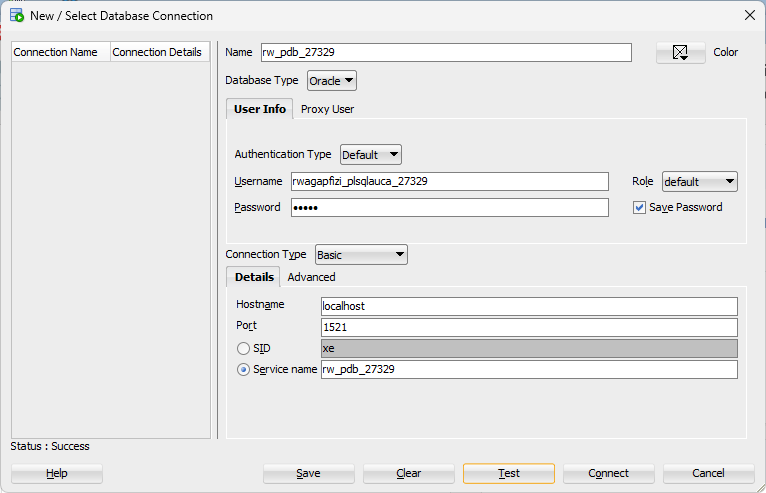

# Oracle Pluggable Database (PDB) Management Assignment II

**Student:** Rwagapfizi Igor, 27329  
**Group:** B  
**Course:** Database Development with PL/SQL (INSY 8311)  
**Instructor:** Eric Maniraguha  
**Date:** February 2026  
**Oracle Version:** Oracle Database 21c Express Edition (XE)  
**Repository:** `oracle_pdb_ass_II_27329_Rwagapfizi`

---

## Overview

This repository documents the successful completion of Oracle Pluggable Database (PDB) management tasks, demonstrating proficiency in:

- Creating and managing Pluggable Databases
- User administration within PDBs
- PDB lifecycle management (creation → verification → deletion)
- Oracle Enterprise Manager (EM Express) configuration and access
- Professional documentation and version control using GitHub

---

## Oracle Environment

| Component | Details |
|-----------|---------|
| **Database Version** | Oracle Database 21c Express Edition (21.3.0) |
| **Container Database** | CDB$ROOT (XE) |
| **Pluggable Databases** | XEPDB1 (default), rw_pdb_27329 (created) |
| **Installation OS** | Windows 11 |
| **Management Tools** | SQL*Plus, SQL Developer 24.3.1, Oracle EM Express |
| **Connection Method** | Localhost (1521) with service names |

---

## Task 1: Create a New Pluggable Database

### Objective
Create a PDB with specific naming conventions and establish a user account for future coursework.

### Requirements Met
- PDB Name: `rw_pdb_27329`
- Admin User: `rwagapfizi_plsqlauca_27329`
- Password: `12345`
- User created inside the PDB


### Screenshots


---

## Task 2: Create and Delete a Temporary PDB

### Objective
Demonstrate complete PDB lifecycle management by creating and then permanently removing a temporary PDB.

### Requirements Met
- Created temporary PDB: `rw_to_delete_pdb_27329`
- Verified its existence
- Closed and dropped the PDB completely
- Confirmed permanent removal

### Key Learning
The `INCLUDING DATAFILES` clause is critical for complete removal. Without it, the PDB metadata is removed but physical files remain on disk, potentially consuming storage.

### Screenshots


---

## Task 3: Oracle Enterprise Manager (EM Express)

### Objective
Configure and access Oracle Enterprise Manager to monitor the database environment.

### Implementation

**EM Express Configuration:**
```sql
-- Verify EM Express port (should be 5500)
SELECT dbms_xdb_config.gethttpsport() FROM dual;

-- If not configured, enable it
EXEC DBMS_XDB_CONFIG.SETHTTPSPORT(5500);
```

**Access Details:**
- **URL:** `https://localhost:5500/em`
- **Username:** `system`  

**Alternative Tool:** Due to EM Express connectivity considerations, **Oracle SQL Developer** was used as the primary database management interface. SQL Developer provides comprehensive PDB management capabilities and clearly displays all required evidence including username visibility and PDB operations.

### Dashboard Highlights (SQL Developer)
The SQL Developer interface displays:
- Connection details showing username `rwagapfizi_plsqlauca_27329`
- DBA panel with Pluggable Databases section showing `RW_PDB_27329`
- SQL Worksheet results confirming PDB creation and open state
- Comprehensive database object navigation

### Screenshots


---

## Challenges Faced & Solutions

### Challenge 1: ORA-01031 - Insufficient Privileges
**Issue:** When attempting to open the PDB, received "insufficient privileges" error.

**Solution:** Connected with SYSDBA role:
```bash
sqlplus / as sysdba
```
**Lesson:** PDB management operations require SYSDBA privileges in the CDB root container.

### Challenge 2: ORA-01109 - Database Not Open
**Issue:** SQL Developer connection test failed with "database not open".

**Solution:** Opened the PDB from CDB root:
```sql
ALTER PLUGGABLE DATABASE rw_pdb_27329 OPEN;
```
**Lesson:** PDBs are created in MOUNTED state by default and must be explicitly opened.

### Challenge 3: ORA-00942 - Table or View Does Not Exist
**Issue:** `SELECT name FROM v$pdbs;` worked in SQL*Plus but failed in SQL Developer.

**Solution:** Created a separate connection to the CDB root container using service name `XE` instead of the PDB service name.

**Lesson:** `V$PDBS` is a container-level view that only exists in CDB$ROOT, not within individual PDBs.

### Challenge 4: ORA-12560 - TNS Protocol Adapter Error

**Issue:** After system reboot, SQL*Plus failed to connect with `ORA-12560: TNS:protocol adapter error`, preventing local database access.

```
SQL*Plus: Release 21.0.0.0.0 - Production on Sun Feb 15 09:11:39 2026
ERROR:
ORA-12560: TNS:protocol adapter error
```

**Diagnosis:** This error occurs when the SQL*Plus client cannot locate or communicate with the Oracle database service. Three common causes:
- Oracle database service not running
- Incorrect `ORACLE_SID` environment variable
- Listener service not running or misconfigured

**Solution - Verify Oracle Services:**

1. **Check Windows Services:**
   ```
   Win + R → services.msc
   ```

2. **Ensure these services are RUNNING:**
   - `OracleServiceXE` - The main database instance
   - `OracleOraDB21Home1TNSListener` - The listener service

3. **If services are stopped, start them:**
   - Right-click each service → **Start**
   - Set startup type to **Automatic** for future reboots

4. **Set ORACLE_SID environment variable:**
   ```cmd
   set ORACLE_SID=XE
   sqlplus / as sysdba
   ```

**Alternative Connection Method (Bypasses Listener):**
```cmd
sqlplus sys/12345@//localhost:1521/XE as sysdba
```

**Prevention:** Configure Oracle services to start automatically and add `ORACLE_SID=XE` as a permanent system environment variable.

**Lesson Learned:** Oracle database services do not start automatically after installation by default. After any system reboot, verify both `OracleServiceXE` and the TNS Listener are running before attempting database connections. This is a critical first step in Oracle troubleshooting.

### Challenge 5: EM Express vs. Full OEM
**Issue:** Assignment referenced "Oracle Enterprise Manager" but Oracle XE only includes EM Express, which faced connectivity considerations.

**Solution:** Documented the distinction and utilized **Oracle SQL Developer** as an alternative management interface. SQL Developer clearly shows:
- Connection details with username `rwagapfizi_plsqlauca_27329`
- DBA panel with `RW_PDB_27329` under Pluggable Databases
- Query results confirming PDB operations

---

## Additional Resources

- [Oracle Database 21c Documentation](https://docs.oracle.com/en/database/oracle/oracle-database/21/)
- [Oracle SQL Developer Downloads](https://www.oracle.com/database/sqldeveloper/)
- [Oracle Live SQL](https://livesql.oracle.com/)

---

## Repository Structure

```
.
├── README.md                 # This documentation
└── screenshots/              # All evidence images
    ├── 1-create_pluggable.png
    ├── 2-open_pluggable.png
    ├── 3-temporary_pdbs.png
    ├── 4-sqldeveloper.png
    └── 5-proof_of_connection.png

```

---

*Last updated: February 2026*